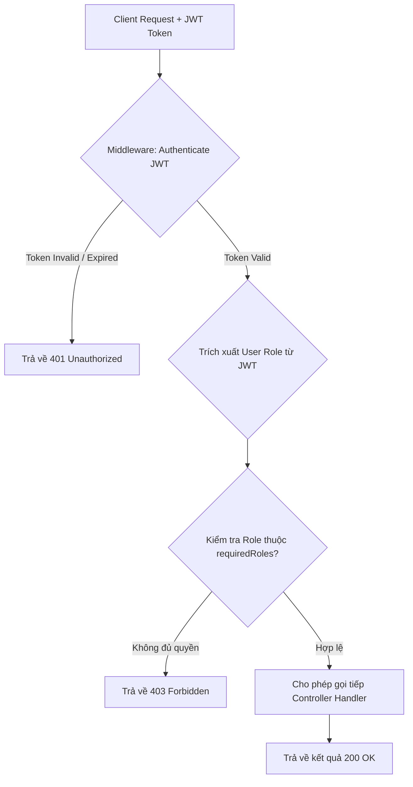

# Kế Hoạch & Phân Tích Kỹ Thuật: Phân quyền vai trò (RBAC) (AUTH-02)

## 📌 Thông Tin Tổng Quan
- **Mã tính năng:** `AUTH-02`
- **Tên tính năng:** Phân quyền vai trò (Role-Based Access Control - RBAC)
- **Module:** Xác thực & Phân quyền
- **Mức độ ưu tiên:** `P0 (Core MVP)`
- **Độ phức tạp:** `Trung bình`
- **Mô tả ngắn:** Phân chia quyền hạn sử dụng trong hệ thống LupBI gồm các nhóm vai trò cơ bản: **Admin** (toàn quyền quản trị), **Creator** (tạo query, chỉnh sửa dashboard), và **Viewer** (chỉ có quyền xem báo cáo/dashboard).

---

## 🎯 Bước 1: Khai Phá & Thu Thập Yêu Cầu (Discovery)
1. **Mục tiêu kinh doanh (Business Goal):** Phân định ranh giới trách nhiệm và quyền hạn thao tác trên hệ thống LupBI, đảm bảo người dùng chỉ được thực hiện đúng các hành động tương ứng với chức vụ/vai trò của mình.
2. **Đối tượng sử dụng (Actors):** Admin (Quản trị viên), Creator (Chuyên viên phân tích/Tạo báo cáo), Viewer (Người xem báo cáo).
3. **Phạm vi (Scope):**
   - **In-Scope:** Phân quyền 3 vai trò cơ bản (Admin, Creator, Viewer), kiểm tra quyền ở Frontend (UI elements, Route navigation) và Backend (Middleware API Guard).
   - **Out-of-Scope (Giai đoạn sau):** Phân quyền chi tiết tới cấp dòng dữ liệu (Row-Level Security - RLS), phân quyền theo phòng ban linh hoạt (Custom Roles).

---

## 👥 Bước 2: Ma Trận Phân Quyền (RBAC Matrix)

| Chức năng / Hành động | Admin | Creator | Viewer |
| :--- | :---: | :---: | :---: |
| Quản lý kết nối Database (Host, Port, Pass) | ✅ | ❌ | ❌ |
| Quản lý Người dùng & Phân quyền | ✅ | ❌ | ❌ |
| Viết & Thực thi SQL Query tự do (Monaco Editor) | ✅ | ✅ | ❌ |
| Tạo, Sửa, Xóa Saved Questions & Dashboards | ✅ | ✅ | ❌ |
| Xem Dashboards & Biểu đồ công khai/nội bộ | ✅ | ✅ | ✅ |
| Xuất dữ liệu báo cáo (CSV/Excel) | ✅ | ✅ | ✅ |

---

## 👤 Bước 3: User Story & Acceptance Criteria (BDD)

### User Story Statement
> Là một **Quản trị viên (Admin) hoặc Người sáng tạo (Creator)**,  
> Tôi muốn **Hệ thống phân chia quyền hạn truy cập theo Vai trò (Role)**,  
> Để **Đảm bảo bảo mật tài nguyên dữ liệu và ngăn chặn người dùng không có quyền chỉnh sửa/xóa báo cáo**.

### Scenario 1: Người dùng Viewer chỉ xem được dữ liệu, không thấy nút Edit/Delete (Happy Path)
- **Given** Người dùng đăng nhập với tài khoản có vai trò `Viewer`.
- **When** Truy cập vào một trang Dashboard bất kỳ.
- **Then** Giao diện ẩn hoàn toàn các nút "Edit Dashboard", "New Query", "Delete Widget".
- **And** Người dùng chỉ có thể thao tác lọc dữ liệu và xem biểu đồ.

### Scenario 2: Ngăn chặn truy cập API trái phép từ Backend (Security Enforcement)
- **Given** Người dùng `Viewer` cố tình gọi trực tiếp API `POST /api/v1/queries/run` để chạy SQL tự do.
- **When** Backend Middleware kiểm tra JWT Role của request.
- **Then** Backend từ chối thực thi, trả về lỗi `403 Forbidden` kèm thông báo "Bạn không có quyền thực hiện hành động này".

---

## 🏗️ Phân Phối Tác Vụ Kỹ Thuật (Task Breakdown)

### 1. Frontend (Next.js / React TS)
- [ ] **Component Phân Quyền (`<Can />` hoặc `PermissionGate`):** Wrapper component nhận vào `requiredRoles` để ẩn/hiện các phần UI (menu, button, form).
- [ ] **Navigation Guard:** Lọc danh sách Sidebar Menu theo role của user đang đăng nhập.
- [ ] **Route Protection Advanced:** Ngăn truy cập vào các route của Creator/Admin (ví dụ: `/queries/new`, `/settings/connections`).

### 2. Backend (Node.js / Express / NestJS TS)
- [ ] **Database Schema:** 
  - Bảng `roles` (id, code, name, description). Dữ liệu mẫu: `ADMIN`, `CREATOR`, `VIEWER`.
  - Liên kết `users.role_id` -> `roles.id`.
- [ ] **RBAC Middleware (`checkRole`):** 
  - Middleware kiểm tra role từ Access Token JWT.
  - Ví dụ: `router.post('/connections', authMiddleware, checkRole(['ADMIN']), createConnectionController)`.
- [ ] **Data Ownership Guard:** Đảm bảo Creator chỉ có thể sửa/xóa Question hoặc Dashboard do chính mình tạo ra (hoặc Admin).

---

## 🧪 Bước 4: Quy Trình Kiểm Thử Release Candidate (RC Testing Steps)

### 1. Điều Kiện Tiên Quyết (RC Pre-conditions)
- Đã khởi tạo 3 tài khoản thử nghiệm trên môi trường Staging/RC:
  - Admin: `admin_test@lupbi.com` (Role: ADMIN)
  - Creator: `creator_test@lupbi.com` (Role: CREATOR)
  - Viewer: `viewer_test@lupbi.com` (Role: VIEWER)

### 2. Danh Sách Kịch Bản Kiểm Thử RC (RC Test Verification Checklist)

| STT | Tên kịch bản | Thao tác kiểm thử (Test Steps) | Kết quả kỳ vọng (Expected Output) | Trạng thái RC |
| :---: | :--- | :--- | :--- | :---: |
| **RC-01** | UI Visibility - Viewer | Đăng nhập `viewer_test` -> Vào Dashboard | Không xuất hiện các nút "Tạo mới", "Sửa", "Xóa", "Cấu hình DB" | 🟩 PASS |
| **RC-02** | UI Visibility - Creator | Đăng nhập `creator_test` -> Vào SQL Editor | Hiển thị nút "Tạo Query", "Lưu Dashboard", nhưng ẩn menu "Quản lý kết nối DB" | 🟩 PASS |
| **RC-03** | Navigation Route Guard | Đăng nhập `viewer_test` -> Nhập URL `/settings/connections` | Tự động chuyển hướng về `/dashboard` kèm alert "Bạn không có quyền" | 🟩 PASS |
| **RC-04** | Backend API Protection | Dùng Postman gửi token của `viewer_test` gọi `POST /api/v1/connections` | Trả về HTTP 403 Forbidden | 🟩 PASS |
| **RC-05** | Admin Full Access | Đăng nhập `admin_test` -> Thao tác tất cả chức năng | Thực hiện thành công 100% các chức năng quản trị & tạo mới | 🟩 PASS |

### 3. Tiêu Chí Hủy Bản RC (Rollback Criteria)
- ❌ **Security Violation:** Tài khoản Viewer có thể thực thi SQL tự do hoặc truy cập trang quản trị DB.

---

## 🔀 Sơ Đồ Kiểm Tra Quyền RBAC Tại Middleware (Mermaid Flowchart)

---

## 📊 Tiến Độ Hoàn Thành & Ghi Chú Nghiệm Thu (QA Sign-off & Feedback)

- **Tiến độ hoàn thành:** `0%` (Chờ triển khai & kiểm thử)
- **Trạng thái:** `Ready for Dev`

### 📝 Ghi Chú & Nhận Xét Từ QA (Tester Notes)
*(Chờ QA chạy skill kiểm thử nghiệm thu `qa-test-execution` để điền phần trăm % hoàn thành và các nhận xét về Lỗi nghiệp vụ, UI xấu, Tốc độ chậm, Khó thao tác, Sai cấu trúc...)*
