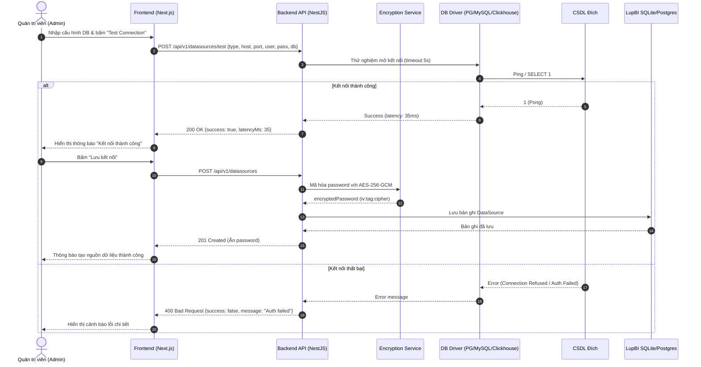

# Kế Hoạch & Phân Tích Kỹ Thuật: Quản lý kết nối Database (CONN-01)

## 📌 Thông Tin Tổng Quan
- **Mã tính năng:** `CONN-01`
- **Tên tính năng:** Quản lý kết nối Database (Database Connection Management)
- **Module:** Nguồn dữ liệu (Data Sources)
- **Mức độ ưu tiên:** `P0 (Core MVP)`
- **Độ phức tạp:** `Cao`
- **Mô tả ngắn:** Cung cấp giao diện và hệ thống quản lý các kết nối đến các hệ quản trị CSDL đích (PostgreSQL, MySQL, ClickHouse, SQLite), hỗ trợ mã hóa mật khẩu AES-256-GCM, kiểm tra kết nối (Test Ping) và quản lý Connection Pool an toàn.

---

## 🎯 Bước 1: Khai Phá & Thu Thập Yêu Cầu (Discovery)
1. **Mục tiêu kinh doanh (Business Goal):** Cho phép hệ thống LupBI kết nối an toàn đến các kho dữ liệu (Data Warehouses/Databases) của doanh nghiệp để phục vụ truy vấn, phân tích và trực quan hóa dữ liệu mà không làm rò rỉ thông tin đăng nhập nhạy cảm.
2. **Đối tượng sử dụng (Actors):**
   - **Admin:** Toàn quyền thêm mới, chỉnh sửa, xóa, kiểm tra và bật/tắt các kết nối CSDL.
   - **Creator:** Xem danh sách CSDL khả dụng để chọn nguồn khi viết SQL Query (không xem được mật khẩu/thông tin bảo mật).
   - **Viewer:** Không có quyền truy cập vào cấu hình nguồn dữ liệu.
3. **Phạm vi (Scope):**
   - **In-Scope:**
     - Hỗ trợ các driver: `PostgreSQL`, `MySQL`, `ClickHouse`, `SQLite`.
     - Cấu hình kết nối: Host, Port, Database name, Username, Password, SSL mode (disable, require, prefer), Connection Timeout, Max Pool Size.
     - Mã hóa mật khẩu lưu trữ trong CSDL nội bộ bằng thuật toán **AES-256-GCM** kèm `IV` ngẫu nhiên.
     - API kiểm tra kết nối tức thời (Test Connection / Ping) trước khi lưu.
     - CRUD danh sách Data Sources, bật/tắt (Active/Inactive), gán nhãn môi trường (Prod, Staging, Dev).
   - **Out-of-Scope (Giai đoạn sau):** Kết nối qua SSH Tunnel / Bastion Host, OAuth / IAM Authentication cho Cloud DB (BigQuery, Snowflake).

---

## ⚙️ Bước 2: Yêu Cầu Chức Năng & Phi Chức Năng

### Yêu Cầu Chức Năng (Functional Requirements)
- `FR-CONN-01`: Form thêm/sửa kết nối có đầy đủ validation cho từng loại DB (Default port: PG 5432, MySQL 3306, ClickHouse 8123).
- `FR-CONN-02`: Nút "Test Connection" gửi thông tin kết nối lên Backend để thử nghiệm kết nối trong vòng tối đa 5 giây và trả về thông báo trạng thái kèm độ trễ (latency ms).
- `FR-CONN-03`: Mật khẩu lưu trong CSDL nội bộ phải được mã hóa AES-256; API `GET /api/v1/datasources` tuyệt đối không trả về mật khẩu gốc (chỉ trả về cờ `hasPassword: true`).
- `FR-CONN-04`: Cơ chế Connection Pool Manager tại Backend tự động khởi tạo pool theo nhu cầu, tự giải phóng kết nối không hoạt động (idle timeout 10 phút) và tái sử dụng pool.
- `FR-CONN-05`: Xóa kết nối (Soft Delete hoặc chặn xóa nếu đang có Saved Questions / Dashboards phụ thuộc).

### Yêu Cầu Phi Chức Năng (Non-Functional Requirements)
- `NFR-CONN-01`: Thời gian thực hiện Test Connection timeout không vượt quá 5000ms.
- `NFR-CONN-02`: Đảm bảo an toàn bộ nhớ: không tạo connection pool vô hạn gây cạn kiệt RAM server (giới hạn tối đa 10 pools hoạt động đồng thời, max 10 clients/pool cho MVP).
- `NFR-CONN-03`: Bảo mật: Mật mã khóa `ENCRYPTION_KEY` được đọc từ biến môi trường, không lưu cứng trong code.

---

## 👤 Bước 3: User Story & Acceptance Criteria (BDD)

### User Story Statement
> Là một **Quản trị viên (Admin)**,  
> Tôi muốn **Thêm và quản lý các kết nối Database với cơ chế mã hóa và kiểm tra kết nối**,  
> Để **Cho phép đội ngũ phân tích (Creator) truy vấn dữ liệu an toàn mà không làm lộ thông tin đăng nhập của CSDL**.

### Scenario 1: Kiểm tra kết nối thành công trước khi lưu (Happy Path)
- **Given** Admin đang ở trang Cấu hình Nguồn dữ liệu (`/settings/datasources/new`).
- **When** Admin chọn loại CSDL `PostgreSQL`, nhập đúng Host, Port 5432, Database `sales_db`, User `postgres`, Password và nhấn nút "Test Connection".
- **Then** Hệ thống hiển thị trạng thái loading, Backend thử kết nối và trả về mã 200 OK với thông báo "Kết nối thành công! Độ trễ: 45ms".
- **And** Nút "Lưu kết nối" được kích hoạt để Admin lưu lại.

### Scenario 2: Kiểm tra kết nối thất bại do sai thông tin (Exception Path)
- **Given** Admin nhập sai Password hoặc Host không thể phân giải DNS.
- **When** Nhấn nút "Test Connection".
- **Then** Hệ thống bắt lỗi từ Driver và trả về thông báo chi tiết: "Kết nối thất bại: Password authentication failed / Connection timed out".
- **And** Nút "Lưu kết nối" hiển thị cảnh báo để tránh lưu cấu hình hỏng.

### Scenario 3: Creator chỉ thấy danh sách Data Source khả dụng mà không thấy thông tin mật khẩu
- **Given** Creator đăng nhập vào trang tạo Query (`/queries/new`).
- **When** Mở dropdown chọn nguồn dữ liệu.
- **Then** Chỉ hiển thị Tên kết nối, Loại CSDL (`PostgreSQL`), Trạng thái (`Active`), không thể xem Host/User/Password.

---

## 🏗️ Phân Phối Tác Vụ Kỹ Thuật (Task Breakdown)

### 1. Database & Shared Types
- [ ] **Prisma Schema (`DataSource` model):**
  - `id`: String (cuid)
  - `name`: String
  - `type`: Enum (`POSTGRES`, `MYSQL`, `CLICKHOUSE`, `SQLITE`)
  - `host`: String?
  - `port`: Int?
  - `database`: String
  - `username`: String?
  - `encryptedPassword`: String? (`encrypted_password`)
  - `ssl`: Boolean @default(false)
  - `isActive`: Boolean @default(true)
  - `createdAt`, `updatedAt`
- [ ] **Shared Types DTOs (`packages/shared-types`):**
  - `DataSourceType`, `CreateDataSourceDto`, `UpdateDataSourceDto`, `DataSourceResponseDto`, `TestConnectionDto`, `TestConnectionResultDto`.

### 2. Backend (NestJS / Express TS)
- [ ] **Crypto Service:** Module `EncryptionService` mã hóa / giải mã chuỗi với `aes-256-gcm` (Random IV 16 bytes, Auth Tag 16 bytes).
- [ ] **Driver Adapters (`DataSourceDriver` interface):**
  - `PostgresDriver`: Sử dụng `pg` Pool.
  - `MySqlDriver`: Sử dụng `mysql2/promise` Pool.
  - `ClickHouseDriver`: Sử dụng `@clickhouse/client`.
- [ ] **Connection Pool Manager:** Quản lý cache các pool instance theo `dataSourceId`, ngắt kết nối khi update/delete.
- [ ] **Controller & RBAC Guard:**
  - `GET /api/v1/datasources`: Danh sách (Admin thấy đầy đủ, Creator thấy metadata cơ bản).
  - `POST /api/v1/datasources/test`: Test kết nối (Admin only).
  - `POST /api/v1/datasources`: Tạo kết nối (Admin only).
  - `PUT /api/v1/datasources/:id`: Cập nhật kết nối (Admin only).
  - `DELETE /api/v1/datasources/:id`: Xóa kết nối (Admin only).

### 3. Frontend (Next.js / React TS)
- [ ] **UI Data Source List (`/settings/datasources`):** Bảng danh sách nguồn dữ liệu, badge trạng thái Active/Inactive, nút Edit, Delete, Test.
- [ ] **UI Data Source Form Modal / Page:** Form chọn DB Type (Card selector), input host, port, db name, user, password, checkbox SSL, nút Test Connection với loading spinner và toast message.
- [ ] **Store / API Service:** Tích hợp `dataSourceApi` với React Query / SWR để tự động invalidate cache khi thêm/sửa/xóa.

---

## 🔀 Sơ Đồ Luồng Tạo & Test Kết Nối (Mermaid Sequence Diagram)

---

## 🧪 Bước 4: Quy Trình Kiểm Thử Release Candidate (RC Testing Steps)

### 1. Điều Kiện Tiên Quyết (RC Pre-conditions)
- Khởi chạy sẵn các container CSDL mẫu (PostgreSQL: 5432, MySQL: 3306, ClickHouse: 8123) trên môi trường Staging/Docker.
- Biến môi trường `DATASOURCE_ENCRYPTION_KEY` đã được thiết lập (32 bytes hex/base64).
- Tài khoản đăng nhập kiểm thử: `admin@lupbi.com` (Admin) và `creator@lupbi.com` (Creator).

### 2. Danh Sách Kịch Bản Kiểm Thử RC (RC Test Verification Checklist)

| STT | Tên kịch bản | Thao tác kiểm thử (Test Steps) | Kết quả kỳ vọng (Expected Output) | Trạng thái RC |
| :---: | :--- | :--- | :--- | :---: |
| **RC-CONN-01** | Test Ping Postgres Thành Công | Nhập thông tin Postgres hợp lệ -> Bấm "Test Connection" | Trả về 200 OK, latency < 100ms, UI hiển thị tick xanh | `[----------] 0%` |
| **RC-CONN-02** | Test Ping Sai Password | Nhập đúng host/user nhưng sai pass -> Bấm "Test Connection" | Báo lỗi 400 rõ ràng "password authentication failed", không crash app | `[----------] 0%` |
| **RC-CONN-03** | Test Mã Hóa Password | Tạo 1 DataSource -> Query trực tiếp bảng `datasources` trong MetaDB | Cột `encrypted_password` là chuỗi mã hóa dạng `iv:tag:ciphertext`, không thấy raw text | `[----------] 0%` |
| **RC-CONN-04** | Bảo Vệ Dữ Liệu Nhạy Cảm | Gọi API `GET /api/v1/datasources` bằng token Admin & Creator | Payload trả về không chứa field `password` hoặc `encryptedPassword`, chỉ có `hasPassword: true` | `[----------] 0%` |
| **RC-CONN-05** | Phân Quyền RBAC | Dùng tài khoản `creator@lupbi.com` gọi `POST /api/v1/datasources` | Backend chặn và trả về HTTP 403 Forbidden | `[----------] 0%` |
| **RC-CONN-06** | Test MySQL & ClickHouse | Thêm kết nối MySQL 8 và ClickHouse với cấu hình tương ứng | Test connection thành công và lưu trữ độc lập không xung đột driver | `[----------] 0%` |

### 3. Tiêu Chí Hủy Bản RC (Rollback Criteria)
- ❌ **Security Blocker:** Mật khẩu kết nối bị rò rỉ nguyên văn (plain text) trong log hoặc response API.
- ❌ **Crash / Leak:** Connection Pool không được giải phóng làm rò rỉ bộ nhớ (Memory Leak) hoặc treo Backend server khi gọi nhiều lần.

---

## 📊 Tiến Độ Hoàn Thành & Ghi Chú Nghiệm Thu (QA Sign-off & Feedback)

- **Tiến độ hoàn thành:** `[----------] 0%` (Chờ triển khai & kiểm thử)
- **UI:** `[----------] 0%`
- **BE:** `[----------] 0%`
- **DB:** `[----------] 0%`
- **Trạng thái:** `Ready for Dev`

### 📝 Ghi Chú & Nhận Xét Từ QA (Tester Notes)
*(Chờ QA chạy skill kiểm thử nghiệm thu `qa-test-execution` để điền phần trăm % hoàn thành và các nhận xét về Lỗi nghiệp vụ, UI xấu, Tốc độ chậm, Khó thao tác, Sai cấu trúc...)*
