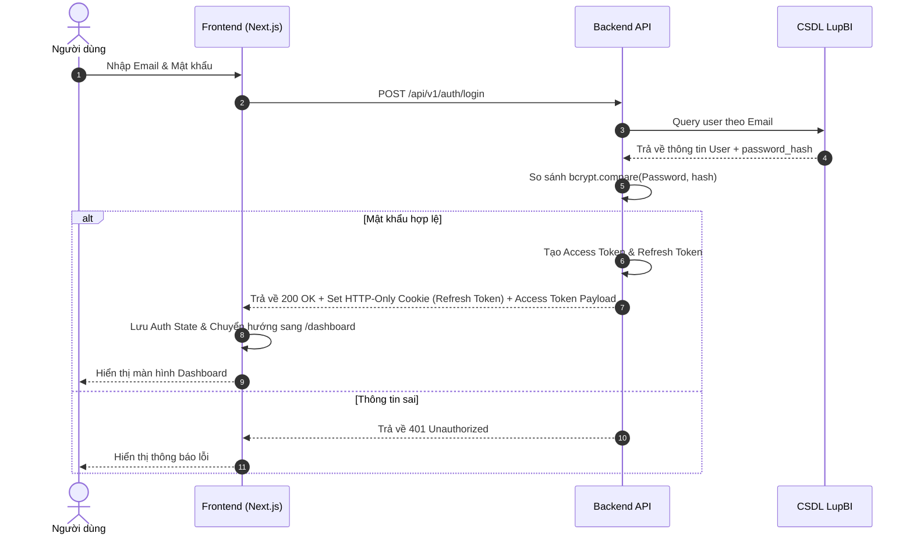

# Kế Hoạch & Phân Tích Kỹ Thuật: Đăng nhập & Quản lý Phiên (AUTH-01)

## 📌 Thông Tin Tổng Quan
- **Mã tính năng:** `AUTH-01`
- **Tên tính năng:** Đăng nhập & Quản lý Phiên (Login & Session Management)
- **Module:** Xác thực & Phân quyền
- **Mức độ ưu tiên:** `P0 (Core MVP)`
- **Độ phức tạp:** `Trung bình`
- **Mô tả ngắn:** Phân hệ xác thực tài khoản nội bộ cho phép người dùng đăng nhập hệ thống LupBI an toàn, sử dụng JWT (JSON Web Token) kết hợp Session Cookie và cơ chế Refresh Token.

---

## 🎯 Bước 1: Khai Phá & Thu Thập Yêu Cầu (Discovery)
1. **Mục tiêu kinh doanh (Business Goal):** Bảo mật quyền truy cập hệ thống BI của LupBI, ngăn ngừa truy cập trái phép vào các báo cáo và dữ liệu kinh doanh nhạy cảm.
2. **Đối tượng sử dụng (Actors):** Tất cả nhân sự có tài khoản hệ thống (Admin, Creator, Viewer).
3. **Phạm vi (Scope):**
   - **In-Scope:** Đăng nhập bằng Email/Password, cấp phát JWT Access Token & Refresh Token Cookie, làm mới phiên làm việc tự động (Silent Refresh), Đăng xuất (Logout).
   - **Out-of-Scope (Giai đoạn sau):** Đăng nhập qua SSO (Google/OAuth2/SAML), Xác thực 2 yếu tố (2FA/MFA).

---

## ⚙️ Bước 2: Yêu Cầu Chức Năng & Phi Chức Năng

### Yêu Cầu Chức Năng (Functional Requirements)
- `FR-01`: Giao diện Login nhận vào Email và Password có kiểm tra định dạng client-side.
- `FR-02`: Mã hóa mật khẩu lưu trữ trong CSDL bằng thuật toán `bcrypt` với `saltRounds >= 10`.
- `FR-03`: Trả về Access Token (thời hạn 15 phút) trong JSON payload và Refresh Token (thời hạn 7 ngày) trong HTTP-Only Cookie.
- `FR-04`: Tự động gửi request refresh token khi Access Token hết hạn thông qua Axios/Fetch Interceptor.
- `FR-05`: Xóa Cookie & vô hiệu hóa token khi người dùng nhấn Logout.

### Yêu Cầu Phi Chức Năng (Non-Functional Requirements)
- `NFR-01`: Thời gian phản hồi của API login < 300ms.
- `NFR-02`: Chống tấn công XSS (lưu Refresh Token ở HTTP-Only Cookie) và CSRF (SameSite=Strict/Lax).
- `NFR-03`: Giới hạn thử đăng nhập (Rate Limiting) tối đa 5 lần thất bại trong 1 phút để chống Brute Force.

---

## 👤 Bước 3: User Story & Acceptance Criteria (BDD)

### User Story Statement
> Là một **Người dùng hệ thống LupBI**,  
> Tôi muốn **Đăng nhập bằng Email/Username và Mật khẩu**,  
> Để **Truy cập an toàn vào hệ thống phân tích dữ liệu và quản lý phiên làm việc của mình**.

### Scenario 1: Đăng nhập thành công với thông tin hợp lệ (Happy Path)
- **Given** Người dùng ở màn hình đăng nhập `/login` và chưa đăng nhập hệ thống.
- **When** Người dùng nhập đúng Email/Username và Password hợp lệ, sau đó nhấn nút "Đăng nhập".
- **Then** Hệ thống xác thực thông tin, mã hóa cấp phát Access Token (thời hạn ngắn, 15 phút) và Refresh Token (HTTP-Only Cookie).
- **And** Tự động chuyển hướng người dùng sang trang chính `/dashboard` với đầy đủ trạng thái User Context.

### Scenario 2: Đăng nhập thất bại do sai thông tin (Exception Path)
- **Given** Người dùng ở trang `/login`.
- **When** Nhập sai Email/Username hoặc Password và nhấn "Đăng nhập".
- **Then** Hệ thống trả về lỗi 401 Unauthorized và hiển thị thông báo "Tên đăng nhập hoặc mật khẩu không chính xác".
- **And** Giữ nguyên form đăng nhập để người dùng nhập lại.

### Scenario 3: Tự động gia hạn phiên làm việc (Silent Refresh Token)
- **Given** Access Token của người dùng hết hạn nhưng Refresh Token trong Cookie còn hiệu lực.
- **When** Người dùng thực hiện gọi API bất kỳ.
- **Then** Axios/Fetch Interceptor ở Frontend tự động gửi request refresh token lên Backend.
- **And** Backend trả về Access Token mới mượt mà mà không bắt người dùng đăng nhập lại.

---

## 🏗️ Phân Phối Tác Vụ Kỹ Thuật (Task Breakdown)

### 1. Frontend (Next.js / React TS)
- [ ] **UI Component:** Bố cục Form Login thanh lịch, ô nhập Email, Password, nút Toggle hiển thị mật khẩu, Nút Submit trạng thái loading.
- [ ] **State Management:** Tạo `AuthContext` hoặc Zustand Store quản lý trạng thái `user`, `isAuthenticated`, `isLoading`.
- [ ] **Route Protection:** Cấu hình Next.js Middleware hoặc HOC `withAuth` bảo vệ các private routes (`/dashboard`, `/queries`, `/settings`), tự động redirect về `/login` nếu chưa auth.
- [ ] **API Interceptor:** Cấu hình Axios Response Interceptor tự động bắt mã lỗi `401` để trigger làm mới token (Refresh Token).

### 2. Backend (Node.js / Express / NestJS TS)
- [ ] **Database Schema:** Bảng `users` (id, email, password_hash, full_name, role_id, is_active, created_at, updated_at).
- [ ] **Security Hashing:** Sử dụng thư viện `bcrypt` với salt rounds >= 10 để hash mật khẩu người dùng.
- [ ] **Token Generation:** Đăng ký hàm sign/verify JWT (Access Token payload gồm `userId`, `role`).
- [ ] **Session Cookie:** Lưu Refresh Token vào HTTP-Only, Secure, SameSite Cookie để chống tấn công XSS.
- [ ] **Endpoints Core:**
  - `POST /api/v1/auth/login`: Xác thực thông tin & trả về token.
  - `POST /api/v1/auth/refresh`: Cấp lại Access Token mới.
  - `POST /api/v1/auth/logout`: Xóa Refresh Token Cookie & hủy phiên.
  - `GET /api/v1/auth/me`: Lấy thông tin user hiện tại.

---

## 🧪 Bước 4: Quy Trình Kiểm Thử Release Candidate (RC Testing Steps)

### 1. Điều Kiện Tiên Quyết (RC Pre-conditions)
- Môi trường Staging/RC đã được deploy bản build mới nhất của Frontend & Backend.
- CSDL Staging đã có dữ liệu tài khoản mẫu hợp lệ (`admin@lupbi.com`, `user@lupbi.com`).
- Cấu hình HTTPS và cookie domain `SameSite=Lax/Strict` hoạt động chuẩn xác.

### 2. Danh Sách Kịch Bản Kiểm Thử RC (RC Test Verification Checklist)

| STT | Tên kịch bản | Thao tác kiểm thử (Test Steps) | Kết quả kỳ vọng (Expected Output) | Trạng thái RC |
| :---: | :--- | :--- | :--- | :---: |
| **RC-01** | Test Login Đúng | Nhập `admin@lupbi.com` / `Password123!` -> Bấm Đăng nhập | Đăng nhập thành công, chuyển hướng `/dashboard`, Cookie có `refreshToken` | 🟩 PASS |
| **RC-02** | Test Login Sai Mật Khẩu | Nhập `admin@lupbi.com` / `WrongPass` -> Bấm Đăng nhập | Báo lỗi 401 "Tên đăng nhập hoặc mật khẩu không chính xác", giữ nguyên màn hình | 🟩 PASS |
| **RC-03** | Test Lockout Brute Force | Nhập sai mật khẩu liên tiếp 5 lần trong 1 phút | Báo lỗi 429 Too Many Requests, khóa thử lại trong 60 giây | 🟩 PASS |
| **RC-04** | Test Silent Refresh Token | Xóa `accessToken` ở Client LocalStorage/Memory -> Gọi API | Axios Interceptor tự gọi `/auth/refresh` lấy Access Token mới không gián đoạn | 🟩 PASS |
| **RC-05** | Test Logout | Tại trang Dashboard -> Bấm nút "Đăng xuất" | Xóa Refresh Cookie, xóa Auth State, chuyển hướng người dùng về lại `/login` | 🟩 PASS |

### 3. Tiêu Chí Hủy Bản RC (Rollback Criteria)
- ❌ **Blocker:** Không thể đăng nhập dù nhập đúng tài khoản/mật khẩu.
- ❌ **Security Critical:** Refresh Token bị lộ dưới dạng plain text ở LocalStorage thay vì HTTP-Only Cookie.

---

## 🔀 Sơ Đồ Luồng Đăng Nhập (Mermaid Sequence Diagram)

